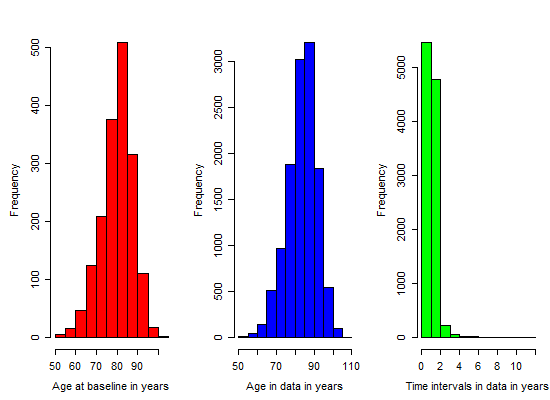

# Model A : Estimation Results

<!-- These two chunks should be added in the beginning of every .Rmd that you want to source an .R script -->
<!--  The 1st mandatory chunck  -->
<!--  Set the working directory to the repository's base directory -->


<!--  The 2nd mandatory chunck  -->
<!-- Set the report-wide options, and point to the external code file. -->


Estimation results of **Model A**, specified by the following input:

```r
q <- .01
# transition matrix
Q <- rbind( c(0, q, 0, q), 
            c(q, 0, q, q),
            c(0, 0, 0, q), 
            c(0, 0, 0, 0)) 
# misclassification matrix
E <- rbind( c( 0,  0,  0, 0),  
            c( 0,  0, .1, 0), 
            c( 0,  0,  0, 0),
            c( 0,  0,  0, 0) )
# transition names
qnames = c(
  "Healthy - Mild",   # q12
  # "Healthy - Severe", # q13
  "Healthy - Dead",  # q14
  "Mild - Healthy",  # q21  
  "Mild - Severe",   # q23
  "Mild - Dead",     # q24
  # "Severe - Healthy",# q31
  # "Severe - Mild",   # q32
  "Severe - Dead"    # q34
)
```


# Load environmet
<!-- Load the sources.  Suppress the output when loading sources. --> 

```r
# base::source("http://www.ucl.ac.uk/~ucakadl/ELECT/ELECT.r") # load  ELECT functions
base::source("./scripts/ELECT.r") # load  ELECT functions
base::source("./scripts/ELECT-utility-functions.R") # ELECT utility functions
```

<!-- Load 'sourced' R files.  Suppress the output when loading packages. --> 

```r
library(magrittr)                         # Pipes
library(msm)                              # multi-state modeling
requireNamespace("ggplot2", quietly=TRUE) # graphing
requireNamespace("dplyr", quietly=TRUE)   # data manipulation
requireNamespace("testit", quietly=TRUE)  # condition testing
```

<!-- Load any Global functions and variables declared in the R file.  Suppress the output. --> 

```

 Objected with fitted models will be saved in the folder : 
```

```
` ./data/shared/derived/models/ `
```

# Load data
<!-- Load the datasets.   -->

```r
# first, the script `0-ellis-island.R` imports and cleans the raw data
# second, the script `1-encode-multistate.R` augments the data with multi-states
# load this data transfer object (dto)
dto <- readRDS("./data/unshared/derived/1-dto.rds")
names(dto)
names(dto$ms_mmse) 
ds_miss <- dto$ms_mmse$missing # data after encoding missing states (-1, -2)
ds_ms <- dto$ms_mmse$multi     # data after encoding multistates (1,2,3,4)
```

<!-- Inspect the datasets.   -->

```r
names(dto)
names(dto[["unitData"]])       # 1st element - unit(person) level data
names(dto[["metaData"]])       # 2nd element - meta data, info about variables
names(dto[["ms_mmse"]])        # 3rd element - data for MMSE outcome
ds_miss <- dto$ms_mmse$missing # data after encoding missing states (-1, -2)
ds_ms <- dto$ms_mmse$multi     # data after encoding multistates (1,2,3,4)

###############################################
##  Part I: data preparation                ##
###############################################
```


```r
# compare before and after ms encoding
view_id <- function(ds1,ds2,id){
  cat("Before ms encoding:","\n")
  print(ds1[ds1$id==id,])
  cat("\nAfter ms encoding","\n")
  print(ds2[ds2$id==id,])
}
ids <- sample(unique(ds_miss$id),1) # view a random person for sporadic inspections
# 50402431 , 37125649, 50101073, 6804844, 83001827 , 56751351, 13485298, 56751351, 75507759)
ids <- c(50402431) #96351191

var_miss <- c("id", "fu_year","age_at_visit","age_at_death", "mmse" )
var_ms   <- c("id", "fu_year","age", "mmse","state" )
cat("\n Demonstrate the mechanics of encoding states: \n")
```

```

 Demonstrate the mechanics of encoding states: 
```

```r
view_id(  
  ds_miss %>% dplyr::select_(.dots=var_miss), 
  ds_ms%>% dplyr::select_(.dots=var_ms),  
  ids) 
```

```
Before ms encoding: 
           id fu_year age_at_visit age_at_death mmse
6101 50402431       0     91.41136     94.82272   19
6102 50402431       1     92.33402     94.82272   12
6103 50402431       2     93.34702     94.82272    5
6104 50402431       3     94.34634     94.82272    0

After ms encoding 
            id fu_year      age mmse state
6101  50402431       0 91.41136   19     3
6102  50402431       1 92.33402   12     3
6103  50402431       2 93.34702    5     3
6104  50402431       3 94.34634    0     3
61011 50402431      NA 94.82272   NA     4
```

# Remove cases

```r
####### 1) Remove observations with missing age
# Initial number of observations with missing age : 
sum(is.na(ds_ms$age))
```

```
[1] 109
```

```r
ds_clean <- ds_ms %>% 
  dplyr::filter(!is.na(age))
# Resultant number of observations with missing age
sum(is.na(ds_clean$age))
```

```
[1] 0
```

```r
####### 2) Remove subjects with only ONE observed data point
# Initial number of subjects who have *n* observed data points
ds_clean %>% 
  dplyr::group_by(id) %>% 
  dplyr::summarize(n_data_points = n()) %>% 
  dplyr::group_by(n_data_points) %>% 
  dplyr::summarize(n_people=n()) %>% 
  print()
```

```
# A tibble: 19 × 2
   n_data_points n_people
           <int>    <int>
1              1      119
2              2      173
3              3      171
4              4      198
5              5      195
6              6      165
7              7      147
8              8      121
9              9       92
10            10       90
11            11       84
12            12      103
13            13       62
14            14       70
15            15       33
16            16        3
17            17       12
18            18        8
19            19        6
```

```r
# Determine which ids have only a single observation
remove_ids <- ds_clean %>% 
  dplyr::group_by(id) %>% 
  dplyr::summarize(n_data_points = n()) %>% 
  dplyr::arrange(n_data_points) %>% 
  dplyr::filter(n_data_points==1) %>% 
  dplyr::select(id)
remove_ids <- remove_ids$id
# How many subjects to be removed from the data set: 
length(remove_ids)
```

```
[1] 119
```

```r
ds_clean <- ds_clean %>% 
  dplyr::filter(!(id %in% remove_ids))
# Resultant number of subjects who have *n* observed data points
ds_clean %>% 
  dplyr::group_by(id) %>% 
  dplyr::summarize(n_data_points = n()) %>% 
  dplyr::group_by(n_data_points) %>% 
  dplyr::summarize(n_people=n()) %>% 
  print()
```

```
# A tibble: 18 × 2
   n_data_points n_people
           <int>    <int>
1              2      173
2              3      171
3              4      198
4              5      195
5              6      165
6              7      147
7              8      121
8              9       92
9             10       90
10            11       84
11            12      103
12            13       62
13            14       70
14            15       33
15            16        3
16            17       12
17            18        8
18            19        6
```

```r
####### 3) Remove subjects with IMS at the first observation
# Initial view of subjects with intermediate missing state at first observation:
ids_firstobs_ims <- ds_clean %>% 
  dplyr::filter(firstobs == TRUE & state == -1) %>% 
  dplyr::select(id) %>% print()
```

```
        id
1 33416479
2 80333458
3 90214403
4 90447310
5 91804757
```

```r
ids_firstobs_ims <- ids_firstobs_ims[,"id"]
# Establish the focal dataset
ds_clean <- ds_clean %>% 
  dplyr::filter(!id %in% ids_firstobs_ims)
# Resultant view of subjects with intermediate missing state at first observation:
ds_clean %>% 
  dplyr::filter(firstobs == TRUE & state == -1) %>% 
  dplyr::select(id) %>% print()
```

```
[1] id
<0 rows> (or 0-length row.names)
```

# Age diagnostic

```r
# Time intervals in data:
# the age difference between timepoint for each individual
intervals <- matrix(NA,nrow(ds_clean),2)
for(i in 2:nrow(ds_clean)){
  if(ds_clean$id[i]==ds_clean$id[i-1]){
    intervals[i,1] <- ds_clean$id[i]
    intervals[i,2] <- ds_clean$age[i]-ds_clean$age[i-1]
  }
  intervals <- as.data.frame(intervals)
  colnames(intervals) <- c("id", "interval")
}
cat("\n Minimum interval length : ",min(intervals[,2], na.rm=T))
```

```

 Minimum interval length :  0.00273785
```

```r
cat("\n Maximum interval length : ", max(intervals[,2], na.rm=T))
```

```

 Maximum interval length :  11.86858
```

```r
# the age difference between timepoint for each individual
intervals <- intervals[!is.na(intervals[,2]),] # Remove NAs:
cat("\nTime intervals between observations within individuals:\n")
```

```

Time intervals between observations within individuals:
```

```r
print(round(quantile(intervals[,2]),digits))
```

```
   0%   25%   50%   75%  100% 
 0.00  0.97  1.00  1.03 11.87 
```

```r
# Info on age and time between obser4vations:
cat("\n Graphs of age distribution :\n")
```

```

 Graphs of age distribution :
```

```r
opar<-par(mfrow=c(1,3), mex=0.8,mar=c(5,5,3,1))
hist(ds_clean$age[ds_clean$firstobs==1],col="red",xlab="Age at baseline in years",main="")
hist(ds_clean$age,col="blue",xlab="Age in data in years",main="")
hist(intervals[,2],col="green",xlab="Time intervals in data in years",main="")
```



```r
opar<-par(mfrow=c(1,1), mex=0.8,mar=c(5,5,2,1))
```

# Estimation prep


```r
# centering decisions
age_center  = 75
year_center = 1900
```


```r
# define the data object to be passed to the estimation call
ds <- ds_clean %>% 
  # dplyr::filter(id %in% ids) %>% # make sample smaller if needed 
  # exclude individuals with missing states
  # dplyr::filter(!id %in% ids_with_im) %>%
  # dplyr::filter(!id %in% ids_with_rc) %>%
  dplyr::mutate(
    male = as.numeric(male), 
    age    = (age - age_center), # centering
    # age_bl = (age_bl - age_bl_center), # centering
    birth_year  = as.integer(birth_year - year_center) # centering (for numerical reasons)
) %>% 
  dplyr::select(
     id            # person identifier
    # ,age_bl        # age at baseline     
    ,birth_year    # year of birth         
    ,male          # sex
    ,edu           # years of education
    ,cogact_old    # cognitive activity
    ,soc_net       # size of social network
    ,fu_year       # follow-up year       
    ,firstobs      # baseline indicator        
    ,age           # age at visit
    ,state         # outcome state encoded from mmse
  )
# save the object to be used during estimation
saveRDS(ds, "./data/unshared/derived/ds_estimation.rds")
```
## Final inspection

```r
ds <- readRDS("./data/unshared/derived/ds_estimation.rds")
# view data object to be passed to the estimation call
cat("\n\n The following dataset will be passed to msm call (view for one person): \n")
```

```


 The following dataset will be passed to msm call (view for one person): 
```

```r
set.seed(44)
ids <- sample(unique(ds$id), 1)
ds %>% dplyr::filter(id %in% ids) %>% knitr::kable()
```

       id   birth_year   male   edu   cogact_old   soc_net   fu_year   firstobs        age   state
---------  -----------  -----  ----  -----------  --------  --------  ---------  ---------  ------
 72650337            9      0    14     1.428571         3         0          1   18.28131       2
 72650337            9      0    14     1.000000         8         1          0   19.36003       1
 72650337            9      0    14     1.428571         7         2          0   20.27447       2
 72650337            9      0    14     1.428571         5         3          0   21.29021       3
 72650337            9      0    14     1.428571         3        NA          0   22.28953       4

```r
cat("\n Subject count : ",length(unique(ds$id)),"\n")
```

```

 Subject count :  1728 
```

```r
cat("\n Frequency of states at baseline\n")
```

```

 Frequency of states at baseline
```

```r
sf <- ds %>% 
  dplyr::filter(firstobs==TRUE) %>% 
  dplyr::group_by(state) %>% 
  dplyr::summarize(count = n()) %>%  # basic frequiencies
  dplyr::mutate(pct = round(count/sum(count),2)) %>%  # percentages, use for starter values
  print()
```

```
# A tibble: 3 × 3
  state count   pct
  <dbl> <int> <dbl>
1     1  1321  0.76
2     2   299  0.17
3     3   108  0.06
```

```r
cat("\n State table: \n") 
```

```

 State table: 
```

```r
print(msm::statetable.msm(state,id,data=ds)) # transition frequencies
```

```
    to
from   -2   -1    1    2    3    4
  -2   29    0    0    0    0    0
  -1    0   43   32   16   28   56
  1    23   70 5921  889  132  307
  2     4   25  636  564  317  178
  3     4   37   26  108  805  301
```

```r
# these will be passed as starting values
initial_probabilities <- as.numeric(as.data.frame(sf[!sf$state %in% c(-1,-2),"pct"])$pct) 
initial_probabilities <- c(initial_probabilities,0) # no death state at first observation
cat('\n The inital values for estimation : ', paste0(initial_probabilities, collapse = ", "))
```

```

 The inital values for estimation :  0.76, 0.17, 0.06, 0
```

```r
###############################################
## Part II : msm computations                ##
###############################################
```

# Specifications

## Fitting functions

```r
estimate_multistate <- function(
  model_name            # code name for the model to be estimated (e.g. mB_v1)
  ,ds                   # data object, clean and ready for estimation
  ,Q                    # Q-matrix of transitions
  ,E                    # misspecification matrix
  ,qnames               # names of the rows in the Q matrix
  ,cf                   # string with covariate names for forward transitions
  ,cb                   # string with covariate names for backward transitions
  ,cd                   # string with covariate names for death transitions
){
  cov_forward  <- as.formula(paste0("~",cf))
  cov_backward <- as.formula(paste0("~",cb))
  cov_death    <- as.formula(paste0("~",cd))
  # covariates_ <- as.formula(paste0("~",cov_names))
  covariates_    = list(
    "1-2"       = cov_forward,
    "2-3"       = cov_forward,
    "2-1"       = cov_backward,
    "1-4"       = cov_death,
    "2-4"       = cov_death,
    "3-4"       = cov_death
  )  
  model <- msm(
    formula       = state ~ age,
    subject       = id,
    data          = ds,
    center        = FALSE,
    qmatrix       = Q,
    ematrix       = E,
    death         = TRUE,
    covariates    = covariates_,
    censor        = c(-1,-2),
    censor.states = list(c(1,2,3), c(1,2,3)),
    method        = method_,
    constraint    = constraint_,
    fixedpars     = fixedpars_,
    initprobs     = initprobs_,
    est.initprobs = TRUE,
    control       = list(trace=0,REPORT=1,maxit=1000,fnscale=10000)
  )
  # model <- paste0("test", covariates_)
  saveRDS(model, paste0(path_folder,model_name,".rds"))
  return(model)
} 
```

## Support functions

```r
get_crude_Q <- function(
  ds
  ,Q
  ,cov_names
){
  formula_ <- as.formula(paste0("state ~ ",cov_names))
  Q_crude <- crudeinits.msm(
    formula = formula_, 
    subject = id, 
    qmatrix = Q, 
    data = ds,     
    censor        = c(-1,-2),
    censor.states = list(c(1,2,3), c(1,2,3)) 
  )
  return(Q_crude)
}

msm_summary <- function(
  model
){
cat("\n-2loglik =", model$minus2loglik,"\n")
cat("Convergence code =", model$opt$convergence,"\n")
p    <- model$opt$par
p.se <- sqrt(diag(solve(1/2*model$opt$hessian)))
print(cbind(p=round(p,digits),
            se=round(p.se,digits),"Wald ChiSq"=round((p/p.se)^2,digits),
            "Pr>ChiSq"=round(1-pchisq((p/p.se)^2,df=1),digits)),
      quote=FALSE)
}

msm_details <- function(
  model
){ 
  # intensity matrix
  cat("\n Intensity matrix : \n")
  print(qmatrix.msm(model)) 
  # qmatrix.msm(model, covariates = list(male = 0))
  # transition probability matrix
  t_ <- 2
  cat("\n Transition probability matrix for t = ", t_," : \n")
  print(pmatrix.msm(model, t = t_)) # t = time, in original metric
  # misclassification matrix
  cat("\n Misclassification matrix : \n")
  suppressWarnings(print(ematrix.msm(model), warnings=F))
  # hazard ratios
  # cat("\n Hazard ratios : \n")
  # print(hazard.msm(model))
  # mean sojourn times
  cat("\n Mean sojourn times : \n")
  print(sojourn.msm(model))
  # probability that each state is next
  cat("\n Probability that each state is next : \n")
  suppressWarnings(print(pnext.msm(model)))
  # total length of stay
  cat("\n  Total length of stay : \n")
  print(totlos.msm(model))
  # expected number of visits to the state
  cat("\n Expected number of visits to the state : \n")
  suppressWarnings(print(envisits.msm(model)))
  # ratio of transition intensities
  # qratio.msm(model,ind1 = c(2,1), ind2 = c(1,2))
}

# adds neat styling to your knitr table
neat <- function(x){
  # knitr.table.format = "html"
  x_t <- x %>%
    # x %>%
    # knitr::kable() %>%
    knitr::kable(format="html") %>%
    kableExtra::kable_styling(
      bootstrap_options = c("striped", "hover", "condensed","responsive"),
      # bootstrap_options = c( "condensed"),
      full_width = F,
      position = "left"
    )
  # cat("\n",x_t,"\n")
  # print(x_t, n=n_)
  return(x_t)
}
# ds %>% distinct(id) %>% count() %>% neat(10)
```

## Model

```r
q <- .01
# transition matrix
Q <- rbind( c(0, q, 0, q), 
            c(q, 0, q, q),
            c(0, 0, 0, q), 
            c(0, 0, 0, 0)) 
# misclassification matrix
E <- rbind( c( 0,  0,  0, 0),  
            c( 0,  0, .1, 0), 
            c( 0,  0,  0, 0),
            c( 0,  0,  0, 0) )
# transition names
qnames = c(
  "Healthy - Mild",   # q12
  # "Healthy - Severe", # q13
  "Healthy - Dead",  # q14
  "Mild - Healthy",  # q21  
  "Mild - Severe",   # q23
  "Mild - Dead",     # q24
  # "Severe - Healthy",# q31
  # "Severe - Mild",   # q32
  "Severe - Dead"    # q34
)
```

## `msm` options

```r
digits = 2
method_  = "BFGS"     # alternatively, if does not converge "Nedler-Mead" 
constraint_ = NULL    # additional model constraints
fixedpars_ = NULL     # fixed parameters
initprobs_ = initial_probabilities 

(Q_crude <- get_crude_Q(ds, Q, "age")) # starting values for estimation
```

```
           [,1]       [,2]       [,3]       [,4]
[1,] -0.1571631  0.1147418  0.0000000 0.04242125
[2,]  0.3384696 -0.6087165  0.1702925 0.09995432
[3,]  0.0000000  0.0000000 -0.2491844 0.24918441
[4,]  0.0000000  0.0000000  0.0000000 0.00000000
```


```r
# turn this chunk OFF when printing the report
# compile model objects with msm() call
# each model will be saved in the specified folder, namely path_folder

# model A_v1
estimate_multistate("A_v1", ds, Q_crude, E, qnames,
                    cf = "age + male  + edu + cogact_old + soc_net",
                    cb = "age",
                    cd = "age + male  + edu + cogact_old + soc_net")

# model A_v2
estimate_multistate("A_v2", ds, Q_crude, E, qnames,
                    cf = "age + male  + edu + cogact_old + soc_net",
                    cb = "age + male  + edu + cogact_old + soc_net",
                    cd = "age + male  + edu + cogact_old + soc_net")
```

# II. Version 1

## Summary

```
msm(formula = state ~ age, subject = id, data = ds, qmatrix = Q, 
    ematrix = E, covariates = covariates_, constraint = constraint_, 
    initprobs = initprobs_, est.initprobs = TRUE, death = TRUE, 
    censor = c(-1, -2), censor.states = list(c(1, 2, 3), c(1, 
        2, 3)), fixedpars = fixedpars_, center = FALSE, method = method_, 
    control = list(trace = 0, REPORT = 1, maxit = 1000, fnscale = 10000))
```

```

-2loglik = 16973.4 
Convergence code = 0 
          p   se Wald ChiSq Pr>ChiSq
qbase -0.08 0.20       0.17     0.68
qbase -2.19 0.54      16.33     0.00
qbase -0.25 0.08       8.41     0.00
qbase -1.08 0.36       8.92     0.00
qbase -4.19 0.88      22.44     0.00
qbase -1.29 0.33      15.01     0.00
qcov   0.07 0.01     158.63     0.00
qcov   0.09 0.01      51.36     0.00
qcov  -0.02 0.01       6.67     0.01
qcov   0.04 0.01      14.13     0.00
qcov   0.06 0.02       6.95     0.01
qcov   0.05 0.01      22.36     0.00
qcov   0.38 0.08      24.17     0.00
qcov   0.44 0.21       4.35     0.04
qcov  -0.14 0.16       0.84     0.36
qcov   0.48 0.27       3.08     0.08
qcov   0.33 0.14       6.03     0.01
qcov  -0.06 0.01      29.13     0.00
qcov  -0.03 0.03       0.89     0.35
qcov   0.01 0.02       0.25     0.62
qcov   0.04 0.04       1.01     0.31
qcov  -0.01 0.02       0.34     0.56
qcov  -0.33 0.05      47.43     0.00
qcov  -0.47 0.13      12.86     0.00
qcov  -0.38 0.08      21.52     0.00
qcov   0.14 0.21       0.44     0.51
qcov  -0.22 0.07       8.82     0.00
qcov  -0.02 0.01      11.66     0.00
qcov  -0.04 0.02       4.94     0.03
qcov  -0.02 0.01       1.33     0.25
qcov  -0.02 0.02       0.47     0.49
qcov  -0.01 0.01       0.86     0.35
p     -2.22 0.09     651.63     0.00
initp -1.39 0.06     497.67     0.00
initp -2.97 0.13     502.76     0.00
```

## Details

```

 Intensity matrix : 
        State 1                      State 2                      State 3                     
State 1 -0.25584 (-0.27434,-0.23858)  0.22442 ( 0.20715, 0.24312) 0                           
State 2  0.67106 ( 0.60888, 0.73960) -0.89068 (-0.96564,-0.82154)  0.14847 ( 0.12550, 0.17565)
State 3 0                            0                            -0.17720 (-0.21955,-0.14301)
State 4 0                            0                            0                           
        State 4                     
State 1  0.03142 ( 0.02548, 0.03874)
State 2  0.07115 ( 0.04770, 0.10613)
State 3  0.17720 ( 0.14301, 0.21955)
State 4 0                           

 Transition probability matrix for t =  2  : 
          State 1   State 2   State 3    State 4
State 1 0.7285721 0.1677427 0.0302387 0.07344654
State 2 0.5015884 0.2540547 0.1215720 0.12278495
State 3 0.0000000 0.0000000 0.7015989 0.29840110
State 4 0.0000000 0.0000000 0.0000000 1.00000000

 Misclassification matrix : 
        State 1 State 2 State 3                  State 4
State 1 1.00000 0       0                        0      
State 2 0       0       0.09756 (0.08352,0.1137) 0      
State 3 0       0       1.00000                  0      
State 4 0       0       0                        1.00000

 Mean sojourn times : 
        estimates         SE        L        U
State 1  3.908744 0.13924992 3.645130 4.191423
State 2  1.122735 0.04628752 1.035582 1.217223
State 3  5.643446 0.61715832 4.554685 6.992467

 Probability that each state is next : 
        State 1                  State 2                  State 3                  State 4                 
State 1 0                        0.87720 (0.84691,0.9009) 0                        0.12280 (0.09907,0.1531)
State 2 0.75343 (0.71827,0.7843) 0                        0.16669 (0.13829,0.1943) 0.07988 (0.05409,0.1182)
State 3 0                        0                        0                        1.00000 (1.00000,1.0000)
State 4 0                        0                        0                        0                       

  Total length of stay : 
  State 1   State 2   State 3   State 4 
11.526892  2.904350  2.433534       Inf 

 Expected number of visits to the state : 
  State 1   State 2   State 3   State 4 
1.9490014 2.5868518 0.4312142 1.0000000 
```

## Hazards
<?xml version="1.0" encoding="UTF-8"?>
<table class="table table-striped table-hover table-condensed table-responsive" style="width: auto !important; text-align: right;">
 <thead>
  <tr>
   <th style="text-align:left;"> transition </th>
   <th style="text-align:left;"> predictor </th>
   <th style="text-align:left;"> dense </th>
  </tr>
 </thead>
<tbody>
  <tr>
   <td style="text-align:left;"> State 1 - State 2 </td>
   <td style="text-align:left;"> age </td>
   <td style="text-align:left;"> 1.08 (1.06, 1.09) </td>
  </tr>
  <tr>
   <td style="text-align:left;"> State 1 - State 4 </td>
   <td style="text-align:left;"> age </td>
   <td style="text-align:left;"> 1.10 (1.07, 1.13) </td>
  </tr>
  <tr>
   <td style="text-align:left;"> State 2 - State 1 </td>
   <td style="text-align:left;"> age </td>
   <td style="text-align:left;"> 0.98 (0.97, 1.00) </td>
  </tr>
  <tr>
   <td style="text-align:left;"> State 2 - State 3 </td>
   <td style="text-align:left;"> age </td>
   <td style="text-align:left;"> 1.04 (1.02, 1.06) </td>
  </tr>
  <tr>
   <td style="text-align:left;"> State 2 - State 4 </td>
   <td style="text-align:left;"> age </td>
   <td style="text-align:left;"> 1.07 (1.02, 1.12) </td>
  </tr>
  <tr>
   <td style="text-align:left;"> State 3 - State 4 </td>
   <td style="text-align:left;"> age </td>
   <td style="text-align:left;"> 1.05 (1.03, 1.07) </td>
  </tr>
  <tr>
   <td style="text-align:left;"> State 1 - State 2 </td>
   <td style="text-align:left;"> male </td>
   <td style="text-align:left;"> 1.46 (1.26, 1.70) </td>
  </tr>
  <tr>
   <td style="text-align:left;"> State 1 - State 4 </td>
   <td style="text-align:left;"> male </td>
   <td style="text-align:left;"> 1.56 (1.03, 2.37) </td>
  </tr>
  <tr>
   <td style="text-align:left;"> State 2 - State 1 </td>
   <td style="text-align:left;"> male </td>
   <td style="text-align:left;"> 1.00 (1.00, 1.00) </td>
  </tr>
  <tr>
   <td style="text-align:left;"> State 2 - State 3 </td>
   <td style="text-align:left;"> male </td>
   <td style="text-align:left;"> 0.87 (0.64, 1.18) </td>
  </tr>
  <tr>
   <td style="text-align:left;"> State 2 - State 4 </td>
   <td style="text-align:left;"> male </td>
   <td style="text-align:left;"> 1.62 (0.95, 2.78) </td>
  </tr>
  <tr>
   <td style="text-align:left;"> State 3 - State 4 </td>
   <td style="text-align:left;"> male </td>
   <td style="text-align:left;"> 1.40 (1.07, 1.82) </td>
  </tr>
  <tr>
   <td style="text-align:left;"> State 1 - State 2 </td>
   <td style="text-align:left;"> edu </td>
   <td style="text-align:left;"> 0.94 (0.92, 0.96) </td>
  </tr>
  <tr>
   <td style="text-align:left;"> State 1 - State 4 </td>
   <td style="text-align:left;"> edu </td>
   <td style="text-align:left;"> 0.97 (0.92, 1.03) </td>
  </tr>
  <tr>
   <td style="text-align:left;"> State 2 - State 1 </td>
   <td style="text-align:left;"> edu </td>
   <td style="text-align:left;"> 1.00 (1.00, 1.00) </td>
  </tr>
  <tr>
   <td style="text-align:left;"> State 2 - State 3 </td>
   <td style="text-align:left;"> edu </td>
   <td style="text-align:left;"> 1.01 (0.97, 1.06) </td>
  </tr>
  <tr>
   <td style="text-align:left;"> State 2 - State 4 </td>
   <td style="text-align:left;"> edu </td>
   <td style="text-align:left;"> 1.04 (0.96, 1.13) </td>
  </tr>
  <tr>
   <td style="text-align:left;"> State 3 - State 4 </td>
   <td style="text-align:left;"> edu </td>
   <td style="text-align:left;"> 0.99 (0.95, 1.03) </td>
  </tr>
  <tr>
   <td style="text-align:left;"> State 1 - State 2 </td>
   <td style="text-align:left;"> cogact_old </td>
   <td style="text-align:left;"> 0.72 (0.65, 0.79) </td>
  </tr>
  <tr>
   <td style="text-align:left;"> State 1 - State 4 </td>
   <td style="text-align:left;"> cogact_old </td>
   <td style="text-align:left;"> 0.62 (0.48, 0.81) </td>
  </tr>
  <tr>
   <td style="text-align:left;"> State 2 - State 1 </td>
   <td style="text-align:left;"> cogact_old </td>
   <td style="text-align:left;"> 1.00 (1.00, 1.00) </td>
  </tr>
  <tr>
   <td style="text-align:left;"> State 2 - State 3 </td>
   <td style="text-align:left;"> cogact_old </td>
   <td style="text-align:left;"> 0.68 (0.58, 0.80) </td>
  </tr>
  <tr>
   <td style="text-align:left;"> State 2 - State 4 </td>
   <td style="text-align:left;"> cogact_old </td>
   <td style="text-align:left;"> 1.15 (0.77, 1.72) </td>
  </tr>
  <tr>
   <td style="text-align:left;"> State 3 - State 4 </td>
   <td style="text-align:left;"> cogact_old </td>
   <td style="text-align:left;"> 0.80 (0.69, 0.93) </td>
  </tr>
  <tr>
   <td style="text-align:left;"> State 1 - State 2 </td>
   <td style="text-align:left;"> soc_net </td>
   <td style="text-align:left;"> 0.98 (0.96, 0.99) </td>
  </tr>
  <tr>
   <td style="text-align:left;"> State 1 - State 4 </td>
   <td style="text-align:left;"> soc_net </td>
   <td style="text-align:left;"> 0.96 (0.93, 1.00) </td>
  </tr>
  <tr>
   <td style="text-align:left;"> State 2 - State 1 </td>
   <td style="text-align:left;"> soc_net </td>
   <td style="text-align:left;"> 1.00 (1.00, 1.00) </td>
  </tr>
  <tr>
   <td style="text-align:left;"> State 2 - State 3 </td>
   <td style="text-align:left;"> soc_net </td>
   <td style="text-align:left;"> 0.98 (0.96, 1.01) </td>
  </tr>
  <tr>
   <td style="text-align:left;"> State 2 - State 4 </td>
   <td style="text-align:left;"> soc_net </td>
   <td style="text-align:left;"> 0.98 (0.94, 1.03) </td>
  </tr>
  <tr>
   <td style="text-align:left;"> State 3 - State 4 </td>
   <td style="text-align:left;"> soc_net </td>
   <td style="text-align:left;"> 0.99 (0.96, 1.01) </td>
  </tr>
</tbody>
</table>

# II. Version 2

## Summary

```
msm(formula = state ~ age, subject = id, data = ds, qmatrix = Q, 
    ematrix = E, covariates = covariates_, constraint = constraint_, 
    initprobs = initprobs_, est.initprobs = TRUE, death = TRUE, 
    censor = c(-1, -2), censor.states = list(c(1, 2, 3), c(1, 
        2, 3)), fixedpars = fixedpars_, center = FALSE, method = method_, 
    control = list(trace = 0, REPORT = 1, maxit = 1000, fnscale = 10000))
```

```

-2loglik = 16964.37 
Convergence code = 0 
          p   se Wald ChiSq Pr>ChiSq
qbase -0.37 0.22       2.69     0.10
qbase -2.35 0.55      18.11     0.00
qbase -0.89 0.27      11.13     0.00
qbase -1.09 0.37       8.81     0.00
qbase -4.02 0.88      21.00     0.00
qbase -1.27 0.33      14.45     0.00
qcov   0.07 0.01     147.96     0.00
qcov   0.09 0.01      50.17     0.00
qcov  -0.02 0.01       9.32     0.00
qcov   0.04 0.01      13.93     0.00
qcov   0.07 0.02       7.47     0.01
qcov   0.05 0.01      22.19     0.00
qcov   0.44 0.09      23.81     0.00
qcov   0.42 0.22       3.79     0.05
qcov   0.14 0.11       1.76     0.18
qcov  -0.11 0.16       0.54     0.46
qcov   0.47 0.28       2.93     0.09
qcov   0.34 0.14       6.36     0.01
qcov  -0.05 0.01      15.80     0.00
qcov  -0.02 0.03       0.50     0.48
qcov   0.02 0.02       1.47     0.23
qcov   0.01 0.02       0.25     0.62
qcov   0.04 0.04       0.73     0.39
qcov  -0.01 0.02       0.38     0.54
qcov  -0.29 0.06      25.94     0.00
qcov  -0.45 0.13      11.81     0.00
qcov   0.10 0.07       2.28     0.13
qcov  -0.38 0.08      21.43     0.00
qcov   0.11 0.20       0.30     0.58
qcov  -0.22 0.07       9.04     0.00
qcov  -0.02 0.01       7.25     0.01
qcov  -0.04 0.02       4.57     0.03
qcov   0.01 0.01       0.51     0.48
qcov  -0.02 0.01       1.31     0.25
qcov  -0.02 0.02       0.50     0.48
qcov  -0.01 0.01       0.91     0.34
p     -2.22 0.09     649.28     0.00
initp -1.39 0.06     498.53     0.00
initp -2.97 0.13     501.23     0.00
```

## Details

```

 Intensity matrix : 
        State 1                      State 2                      State 3                     
State 1 -0.25729 (-0.27621,-0.23968)  0.22577 ( 0.20817, 0.24485) 0                           
State 2  0.68113 ( 0.61542, 0.75384) -0.90015 (-0.97860,-0.82798)  0.14786 ( 0.12493, 0.17501)
State 3 0                            0                            -0.17659 (-0.21889,-0.14246)
State 4 0                            0                            0                           
        State 4                     
State 1  0.03153 ( 0.02559, 0.03884)
State 2  0.07116 ( 0.04765, 0.10626)
State 3  0.17659 ( 0.14246, 0.21889)
State 4 0                           

 Transition probability matrix for t =  2  : 
          State 1   State 2    State 3    State 4
State 1 0.7287187 0.1675174 0.03015188 0.07361207
State 2 0.5053886 0.2517284 0.12049262 0.12239043
State 3 0.0000000 0.0000000 0.70245638 0.29754362
State 4 0.0000000 0.0000000 0.00000000 1.00000000

 Misclassification matrix : 
        State 1 State 2 State 3                  State 4
State 1 1.00000 0       0                        0      
State 2 0       0       0.09834 (0.08423,0.1145) 0      
State 3 0       0       1.00000                  0      
State 4 0       0       0                        1.00000

 Mean sojourn times : 
        estimates        SE        L        U
State 1  3.886599 0.1406611 3.620459 4.172303
State 2  1.110930 0.0473681 1.021864 1.207759
State 3  5.662964 0.6204512 4.568605 7.019464

 Probability that each state is next : 
        State 1                 State 2                 State 3                 State 4                
State 1 0                       0.87747 (0.8485,0.8991) 0                       0.12253 (0.1009,0.1515)
State 2 0.75668 (0.7200,0.7886) 0                       0.16427 (0.1391,0.1916) 0.07905 (0.0527,0.1172)
State 3 0                       0                       0                       1.00000 (1.0000,1.0000)
State 4 0                       0                       0                       0                      

  Total length of stay : 
  State 1   State 2   State 3   State 4 
11.566046  2.900903  2.429069       Inf 

 Expected number of visits to the state : 
  State 1   State 2   State 3   State 4 
1.9758786 2.6112380 0.4289395 1.0000000 
```

## Hazards
<?xml version="1.0" encoding="UTF-8"?>
<table class="table table-striped table-hover table-condensed table-responsive" style="width: auto !important; text-align: right;">
 <thead>
  <tr>
   <th style="text-align:left;"> transition </th>
   <th style="text-align:left;"> predictor </th>
   <th style="text-align:left;"> dense </th>
  </tr>
 </thead>
<tbody>
  <tr>
   <td style="text-align:left;"> State 1 - State 2 </td>
   <td style="text-align:left;"> age </td>
   <td style="text-align:left;"> 1.08 (1.06, 1.09) </td>
  </tr>
  <tr>
   <td style="text-align:left;"> State 1 - State 4 </td>
   <td style="text-align:left;"> age </td>
   <td style="text-align:left;"> 1.10 (1.07, 1.13) </td>
  </tr>
  <tr>
   <td style="text-align:left;"> State 2 - State 1 </td>
   <td style="text-align:left;"> age </td>
   <td style="text-align:left;"> 0.98 (0.96, 0.99) </td>
  </tr>
  <tr>
   <td style="text-align:left;"> State 2 - State 3 </td>
   <td style="text-align:left;"> age </td>
   <td style="text-align:left;"> 1.04 (1.02, 1.06) </td>
  </tr>
  <tr>
   <td style="text-align:left;"> State 2 - State 4 </td>
   <td style="text-align:left;"> age </td>
   <td style="text-align:left;"> 1.07 (1.02, 1.12) </td>
  </tr>
  <tr>
   <td style="text-align:left;"> State 3 - State 4 </td>
   <td style="text-align:left;"> age </td>
   <td style="text-align:left;"> 1.05 (1.03, 1.07) </td>
  </tr>
  <tr>
   <td style="text-align:left;"> State 1 - State 2 </td>
   <td style="text-align:left;"> male </td>
   <td style="text-align:left;"> 1.56 (1.30, 1.87) </td>
  </tr>
  <tr>
   <td style="text-align:left;"> State 1 - State 4 </td>
   <td style="text-align:left;"> male </td>
   <td style="text-align:left;"> 1.53 (1.00, 2.34) </td>
  </tr>
  <tr>
   <td style="text-align:left;"> State 2 - State 1 </td>
   <td style="text-align:left;"> male </td>
   <td style="text-align:left;"> 1.15 (0.93, 1.43) </td>
  </tr>
  <tr>
   <td style="text-align:left;"> State 2 - State 3 </td>
   <td style="text-align:left;"> male </td>
   <td style="text-align:left;"> 0.89 (0.66, 1.21) </td>
  </tr>
  <tr>
   <td style="text-align:left;"> State 2 - State 4 </td>
   <td style="text-align:left;"> male </td>
   <td style="text-align:left;"> 1.61 (0.93, 2.76) </td>
  </tr>
  <tr>
   <td style="text-align:left;"> State 3 - State 4 </td>
   <td style="text-align:left;"> male </td>
   <td style="text-align:left;"> 1.41 (1.08, 1.84) </td>
  </tr>
  <tr>
   <td style="text-align:left;"> State 1 - State 2 </td>
   <td style="text-align:left;"> edu </td>
   <td style="text-align:left;"> 0.95 (0.92, 0.97) </td>
  </tr>
  <tr>
   <td style="text-align:left;"> State 1 - State 4 </td>
   <td style="text-align:left;"> edu </td>
   <td style="text-align:left;"> 0.98 (0.92, 1.04) </td>
  </tr>
  <tr>
   <td style="text-align:left;"> State 2 - State 1 </td>
   <td style="text-align:left;"> edu </td>
   <td style="text-align:left;"> 1.02 (0.99, 1.05) </td>
  </tr>
  <tr>
   <td style="text-align:left;"> State 2 - State 3 </td>
   <td style="text-align:left;"> edu </td>
   <td style="text-align:left;"> 1.01 (0.97, 1.06) </td>
  </tr>
  <tr>
   <td style="text-align:left;"> State 2 - State 4 </td>
   <td style="text-align:left;"> edu </td>
   <td style="text-align:left;"> 1.04 (0.96, 1.12) </td>
  </tr>
  <tr>
   <td style="text-align:left;"> State 3 - State 4 </td>
   <td style="text-align:left;"> edu </td>
   <td style="text-align:left;"> 0.99 (0.95, 1.02) </td>
  </tr>
  <tr>
   <td style="text-align:left;"> State 1 - State 2 </td>
   <td style="text-align:left;"> cogact_old </td>
   <td style="text-align:left;"> 0.75 (0.67, 0.84) </td>
  </tr>
  <tr>
   <td style="text-align:left;"> State 1 - State 4 </td>
   <td style="text-align:left;"> cogact_old </td>
   <td style="text-align:left;"> 0.64 (0.49, 0.82) </td>
  </tr>
  <tr>
   <td style="text-align:left;"> State 2 - State 1 </td>
   <td style="text-align:left;"> cogact_old </td>
   <td style="text-align:left;"> 1.11 (0.97, 1.27) </td>
  </tr>
  <tr>
   <td style="text-align:left;"> State 2 - State 3 </td>
   <td style="text-align:left;"> cogact_old </td>
   <td style="text-align:left;"> 0.68 (0.58, 0.80) </td>
  </tr>
  <tr>
   <td style="text-align:left;"> State 2 - State 4 </td>
   <td style="text-align:left;"> cogact_old </td>
   <td style="text-align:left;"> 1.12 (0.75, 1.66) </td>
  </tr>
  <tr>
   <td style="text-align:left;"> State 3 - State 4 </td>
   <td style="text-align:left;"> cogact_old </td>
   <td style="text-align:left;"> 0.80 (0.69, 0.93) </td>
  </tr>
  <tr>
   <td style="text-align:left;"> State 1 - State 2 </td>
   <td style="text-align:left;"> soc_net </td>
   <td style="text-align:left;"> 0.98 (0.97, 0.99) </td>
  </tr>
  <tr>
   <td style="text-align:left;"> State 1 - State 4 </td>
   <td style="text-align:left;"> soc_net </td>
   <td style="text-align:left;"> 0.96 (0.93, 1.00) </td>
  </tr>
  <tr>
   <td style="text-align:left;"> State 2 - State 1 </td>
   <td style="text-align:left;"> soc_net </td>
   <td style="text-align:left;"> 1.01 (0.99, 1.02) </td>
  </tr>
  <tr>
   <td style="text-align:left;"> State 2 - State 3 </td>
   <td style="text-align:left;"> soc_net </td>
   <td style="text-align:left;"> 0.98 (0.96, 1.01) </td>
  </tr>
  <tr>
   <td style="text-align:left;"> State 2 - State 4 </td>
   <td style="text-align:left;"> soc_net </td>
   <td style="text-align:left;"> 0.98 (0.94, 1.03) </td>
  </tr>
  <tr>
   <td style="text-align:left;"> State 3 - State 4 </td>
   <td style="text-align:left;"> soc_net </td>
   <td style="text-align:left;"> 0.99 (0.96, 1.01) </td>
  </tr>
</tbody>
</table>


# Session Info

```r
sessionInfo()
```

```
R version 3.3.2 (2016-10-31)
Platform: x86_64-w64-mingw32/x64 (64-bit)
Running under: Windows >= 8 x64 (build 9200)

locale:
[1] LC_COLLATE=English_United States.1252  LC_CTYPE=English_United States.1252    LC_MONETARY=English_United States.1252
[4] LC_NUMERIC=C                           LC_TIME=English_United States.1252    

attached base packages:
[1] stats     graphics  grDevices utils     datasets  methods   base     

other attached packages:
[1] msm_1.6.4    magrittr_1.5 nnet_7.3-12  knitr_1.15.1

loaded via a namespace (and not attached):
 [1] Rcpp_0.12.9      xml2_1.1.1       splines_3.3.2    rvest_0.3.2      munsell_0.4.3    testit_0.6      
 [7] colorspace_1.3-2 lattice_0.20-34  R6_2.2.0         httr_1.2.1       highr_0.6        dplyr_0.5.0     
[13] stringr_1.1.0    plyr_1.8.4       tools_3.3.2      grid_3.3.2       gtable_0.2.0     DBI_0.5-1       
[19] selectr_0.3-1    htmltools_0.3.5  assertthat_0.1   lazyeval_0.2.0   survival_2.40-1  yaml_2.1.14     
[25] rprojroot_1.2    digest_0.6.12    tibble_1.2       Matrix_1.2-8     kableExtra_0.1.0 ggplot2_2.2.1   
[31] evaluate_0.10    rmarkdown_1.3    stringi_1.1.2    scales_0.4.1     backports_1.0.5  XML_3.98-1.5    
[37] expm_0.999-1     mvtnorm_1.0-5   
```


